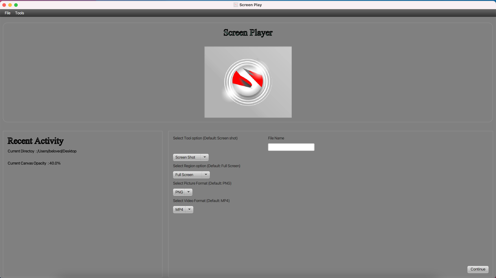

# ScreenPlay

ScreenPlay is a javafx desktop based GUI application, that can screen record your pc and screen grab it.

# Supporting Features

  - Screen Capture and Record (Without audio output)
  - Video and Audio Player
  - Change Opacity of screen canvas and other setting tuning
  - Support for jpeg and png picture format, mp4 video format

# New Features

  - Screen Record with audio Output

# Screen Play

